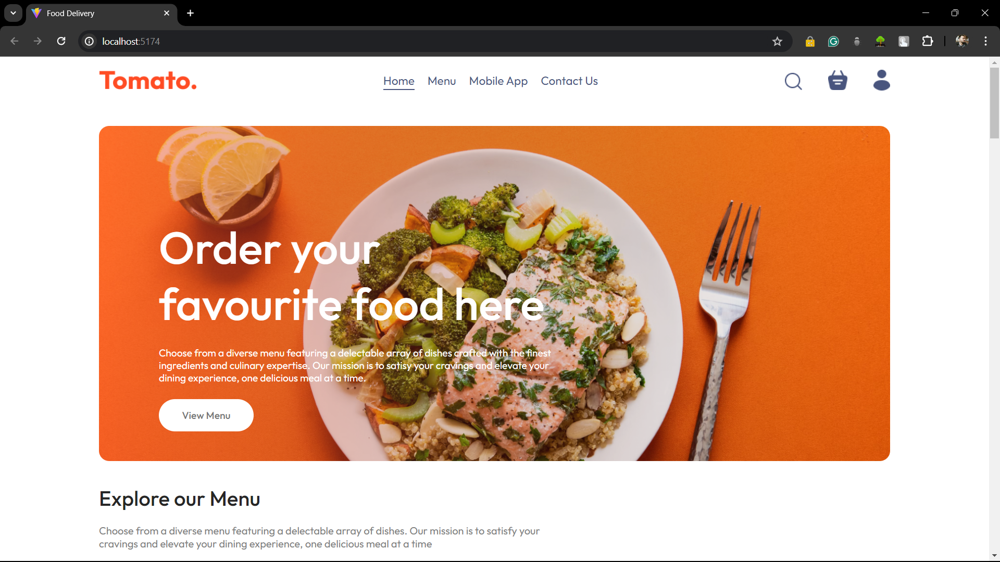
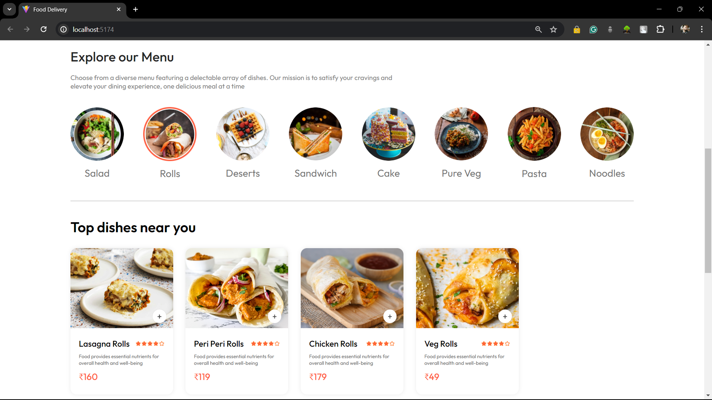
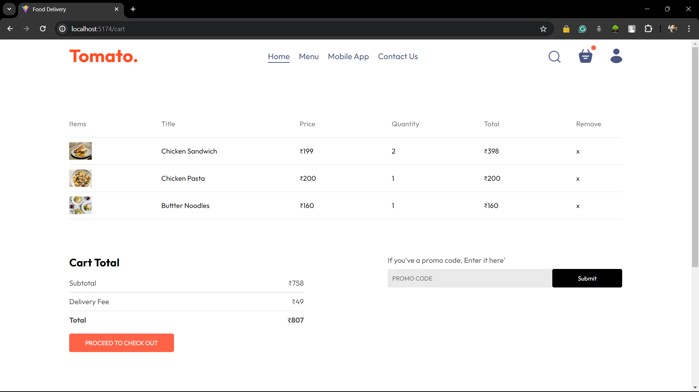
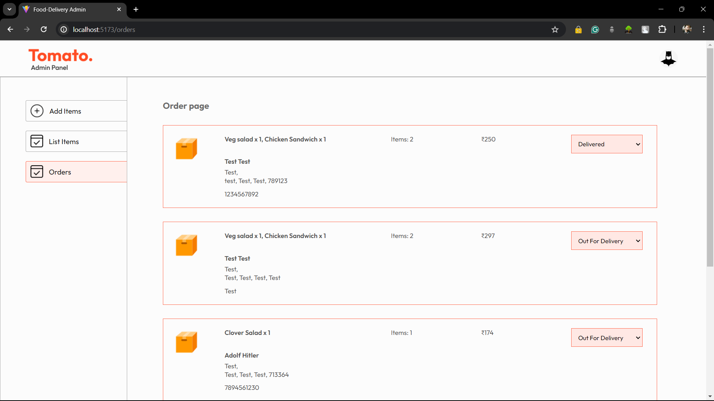

# Food Delivery Web Application

## Overview

This is a Full Stack Food Delivery Web Application built using the MERN stack (MongoDB, Express.js, React, Node.js). It features user authentication, a dynamic menu, and cart functionality, with separate sections for customers and admins. The admin panel allows for managing orders and products, while customers can browse the menu, add items to their cart, and place orders.

## Features

- **User Authentication:** Secure registration and login using JWT.
- **Dynamic Menu:** Browse categorized menu items with detailed descriptions and prices.
- **Cart Functionality:** Add, remove, and manage items in the cart.
- **Order Management:** Admin panel for managing orders and products.
- **Responsive Design:** Optimized for both desktop and mobile devices.

## Technologies Used

- **Frontend:** React.js, HTML, CSS
- **Backend:** Node.js, Express.js
- **Database:** MongoDB
- **Authentication:** JWT, bcrypt
- **State Management:** React Hooks

## Setup Instructions

### Prerequisites

- Node.js
- MongoDB

### Installation

1. **Clone the repository:**
    ```sh
    git clone https://github.com/i-sayankh/food-delivery-app.git
    cd food-delivery-app
    ```

2. **Install dependencies:**
    ```sh
    # For the backend
    cd backend
    npm install

    # For the frontend
    cd ../frontend
    npm install

    # For the admin
    cd ../admin
    npm install
    ```

3. **Set up environment variables:**
   Create a `.env` file in the `backend` directory and add the following:
    ```env
    MONGO_URI=your_mongodb_connection_string
    JWT_SECRET=your_jwt_secret
    ```

4. **Run the development servers:**

    ```sh
    # For the backend
    cd backend
    npm run dev

    # For the frontend
    cd ../frontend
    npm start

    # For the admin panel
    cd ../admin
    npm start
    ```

## Usage

1. **Open the frontend:**
   Navigate to `http://localhost:5174` to use the customer-facing application.

2. **Open the admin panel:**
   Navigate to `http://localhost:5173` to access the admin functionalities.

3. **Explore the features:**
   - Register a new user or log in with existing credentials.
   - Browse the menu, add items to the cart, and place orders.
   - Use the admin panel to manage products and orders.

## Screenshots

### Homepage


### Menu


### Cart


### Admin Panel


## Contributing

Contributions are welcome! Please open an issue or submit a pull request for any enhancements or bug fixes.

## License

This project is licensed under the MIT License.

## Contact

For any inquiries or feedback, please reach out to sayankhutia@gmail.com
